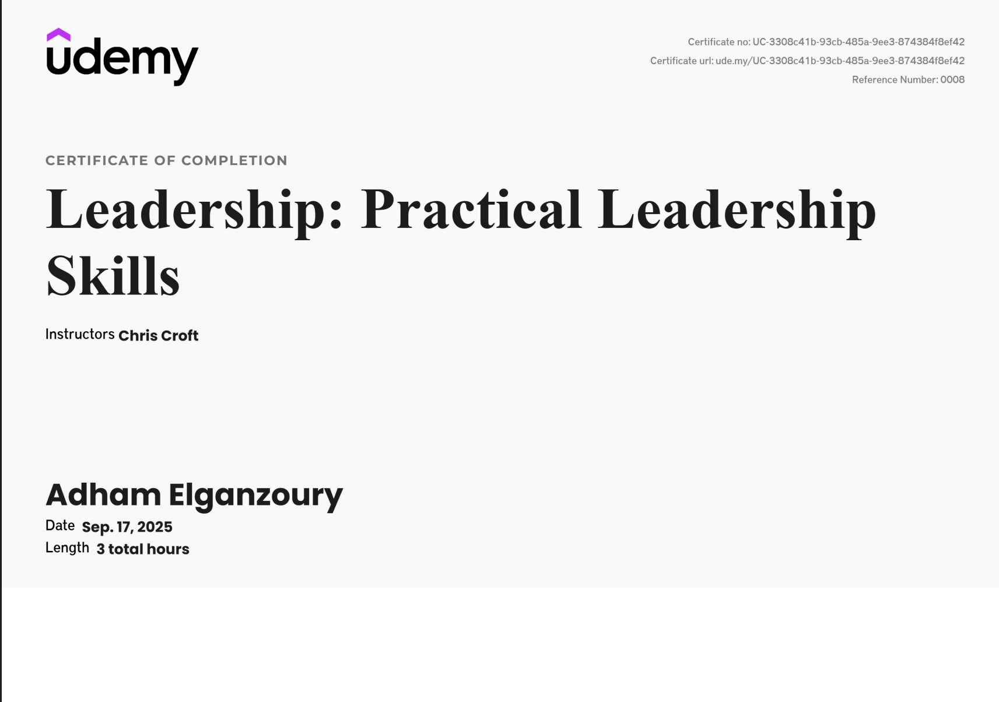

<div align="center">

# 🧭 How to Lead
### Chris Croft's leadership course — rebuilt as a beautiful, bilingual reading experience

**English · العربية (RTL) · Light & Dark · Zero dependencies**

[](https://adham-2002.github.io/chris-croft-how-to-lead/)
[](https://adham-2002.github.io/chris-croft-how-to-lead/ar.html)


> *"Leadership isn't mysterious — it's a set of learnable behaviors performed consistently."*

</div>

---

## 🎓 The journey

I finished the course. These are my notes, turned into something I'd actually want to re-read.



---

## 🚢 The one idea that runs through everything

Picture a ship's captain who greets every passenger by name, serves the soup, and shovels coal in the engine room when the stoker is sick. Admirable. Also: the bridge is empty and the ship is drifting.

Great leaders stay on the bridge. They look after three things:

| 🧑‍🤝‍🧑 People | ⚙️ Systems | 🔭 Vision |
|---|---|---|
| Right roles, motivation, accountability | Processes, quality, continuous improvement | Direction, and when to change the people or the systems |

Everything in the course is a different angle on that picture.

---

## 🗺️ What's inside

| Part | Chapters you'll find |
|---|---|
| **1 · Leading vs. managing** | The Captain story · "Is everything management's fault?" · MBWA & back-to-the-floor · 5 ways to communicate · John Adair |
| **2 · Motivation** | Maslow's hierarchy · The Management Potato (recognition) · 4 personality types · Is money a motivator? · 20 motivational essentials · Maslow × personality |
| **3 · Styles & delegation** | Tannenbaum–Schmidt continuum · Empowerment in practice · 6 reasons to delegate · Objections to delegating · Nick's crash · The cushion story · The 8-step delegation process · Don't take the monkey |
| **4 · Situational leadership** | Competence vs. motivation · Dave's story · The Freedom Ladder · Grip · Planning vs. doing · The banana of boredom · Tell → Delegate |
| **5 · Habits & theory** | The leadership schedule (daily → yearly) · Traits vs. transactional vs. transformational · The Do–Get–Feel loop · Ownership |
| **6 · 14 applied scenarios** | Hard-to-handle situations, each mapped back to the frameworks above |

---

## ✨ What makes the site nice to read

**Reading**
- 📖 Serif body text (Source Serif 4) with a clean UI font — Inter for English, Cairo & Noto Naskh for Arabic
- 🔠 A+ / A− font sizing that remembers your choice
- ⏱️ Reading-time estimate and chapter count at the top
- 📊 Reading-progress bar and a scroll-spy table of contents
- ✅ Chapters you've read get a check mark; a gentle **"resume reading"** toast picks up where you left off

**Navigation**
- 🧭 Sticky sidebar contents on desktop, a slide-in drawer on mobile
- ⬅️➡️ Previous / next chapter cards with titles
- 🔗 Copy-link `#` buttons on every heading
- ⬆️ Back-to-top button and a skip-to-content link

**Comfort & craft**
- 🌗 Light / dark theme, no flash on load (it follows your system until you choose)
- 🖼️ Click any diagram to open it in an accessible lightbox
- 📱 Tables scroll inside cards instead of breaking the page
- ♿ Visible focus outlines, keyboard support, reduced-motion support
- 🖨️ Print stylesheet

---

## 🌍 العربية

The whole course is also available in Arabic, laid out right-to-left with its own typography.

- Full translation of every chapter, plus Arabic UI labels
- One click switches language (`English` ⇄ `العربية`), with `hreflang` links for search engines
- Examples are adapted to an Egyptian context — names, places, currency and weekdays
- A closing chapter retells the **whole course as one story in Egyptian colloquial Arabic**, following a contractor named Medhat from "boss who does everything" to a leader whose company runs fine on holiday

> The Arabic text is my own translation and hasn't been reviewed by a professional translator. Corrections are very welcome.

---

## 🧱 How it's built

No framework, no bundler, no build step. Open the files and they work.

```
chris-croft-how-to-lead/
├── index.html        # English edition
├── ar.html           # Arabic (RTL) edition
├── styles.css        # design tokens, light/dark, RTL overrides, print
├── script.js         # TOC, scroll-spy, progress, lightbox, resume, theme…
├── images/           # course diagrams + certificate
└── .github/workflows/deploy.yml   # GitHub Pages deploy on push to main
```

**Design tokens** drive both themes (`:root` and `html.dark-mode`), so changing a colour in one place changes it everywhere. Language strings are chosen from `document.documentElement.lang`, which is why one script serves both editions.

---

## 🚀 Run it locally

```bash
git clone https://github.com/adham-2002/chris-croft-how-to-lead.git
cd chris-croft-how-to-lead
python -m http.server 8000
```

Then open <http://localhost:8000/> (English) or <http://localhost:8000/ar.html> (Arabic).

> Tip: if you edit CSS or JS and don't see the change, hard-refresh — the simple Python server lets the browser cache aggressively.

---

## 📦 Deploy

Pushing to `main` publishes the site automatically with GitHub Actions to GitHub Pages:

```
https://adham-2002.github.io/chris-croft-how-to-lead/
```

---

## 🤝 Contributing

Typos, a better Arabic phrase, a contrast problem you spotted on your phone — all welcome. Open an issue or a pull request.

---

## 📜 Credits & license

- Course content and frameworks: **Chris Croft**. This is an independent learner's project and is **not affiliated with or endorsed by** him.
- Site design, Arabic edition and code: **Adham Elganzoury**.
- For educational purposes only.

<div align="center">

**Lead the system, not just the work. 🧭**

</div>
